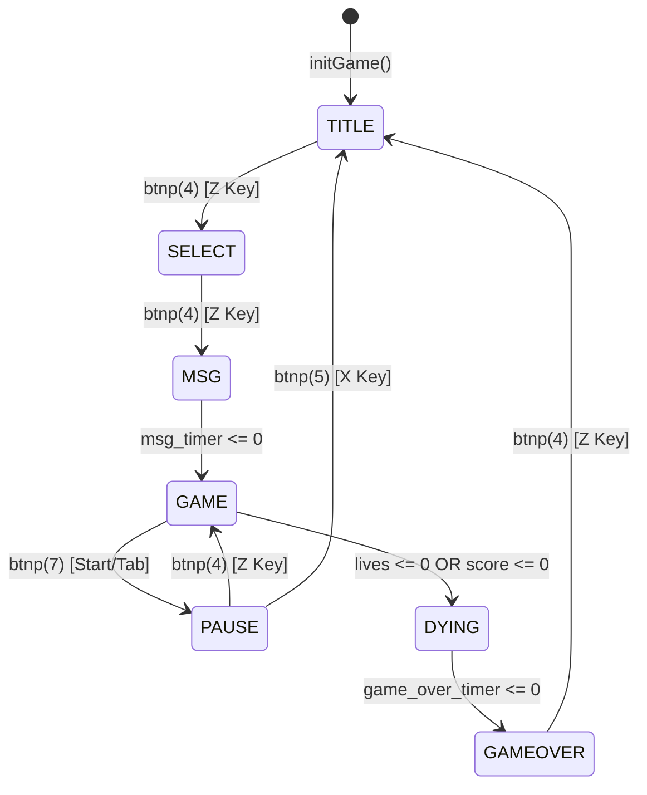

# Defend the Dept

## Overview
Defend the Dept is a lane-based shooter built entirely in the TIC-80 fantasy console using Lua. The project focuses on rigorous state management, procedural rendering techniques to bypass sprite limits, and a highly dynamic, mathematical difficulty scaling engine.

## Code Architecture

### 1. State Machine
The game loop operates on a strict state machine pattern controlled by a single string variable (`state`). The main `TIC()` loop acts as a router, directing the frame execution to isolated state managers:
* `doTitle()`
* `doSelect()`
* `doMsg()`
* `doGame()`
* `doPause()`
* `doDying()`
* `doGameOver()`

This modularity ensures UI logic, gameplay loops, and transitions remain decoupled, preventing frame overlaps and input bleeding between menus and gameplay.

### 2. Entity Management and Garbage Collection
All game objects (bullets, enemies, enemy bullets, powerups) are stored in standard Lua tables. The game safely updates and destroys entities by iterating through these arrays in reverse (`for i=#table,1,-1 do`). This prevents index shifting when `table.remove()` is called, ensuring stable memory management without frame drops during high-density swarms.

### 3. Collision Detection
The engine utilizes a custom Axis-Aligned Bounding Box (AABB) function `collide(a, b, size)` to handle all hit detection. This keeps physics calculations extremely lightweight, which is crucial for TIC-80's CPU constraints when hundreds of projectiles are on screen.

## Core Gameplay Systems

### 1. Multi-Tiered Difficulty Engine
The difficulty is not static. It scales linearly via a time variable (`t/3000`) and hits hard thresholds based on the player's score (100, 200, and 400). These thresholds hook into multiple systems simultaneously:
* **Spawn Rates:** Scales from 1.5 seconds down to aggressive 0.3-second intervals.
* **Cluster Spawning:** Unlocks the ability for the `spawnEnemy()` function to fire 2 or 3 times in a single frame during late-game stages.
* **Enemy Logic:** Increases the ratio of "Shooter" zombies up to 50% in Extreme Mode.
* **Loot Tables:** The powerup drop rate decreases dynamically as the score increases, and the specific RNG weighting shifts (e.g., hearts become significantly rarer than shields or rapid-fire boosts late game).

### 2. Zero-Tolerance Penalty System
To prevent passive play, enemies reaching the left bounds of the screen deduct points instead of lives. A strict evaluation block checks if this penalty reduces the score to zero. If `score <= 0` at any point, the game forces an instant Game Over, overriding the standard health system.

## Procedural Rendering

To preserve standard sprite memory for specific animations, a significant portion of the game's visual assets are drawn procedurally via code execution per frame.
* **Environment:** The EEE Building, animated sun, scrolling clouds, and picket fence are constructed entirely using raw `rect`, `circ`, `line`, and `pix` mathematical commands.
* **Characters and Weapons:** Complex multi-layered characters (Dr. Rakesh Panda, Dr. P. Raja, Varun Sai) are rendered through isolated drawing functions (e.g., `drawCharacter1`). These functions accept scale and coordinate arguments, allowing the same code block to draw a scaled-up character on the select screen and a 1:1 version during gameplay.
* **Juice:** The engine applies visual feedback by injecting a `shake` variable directly into the X/Y coordinates of the render calls upon impact.

## Data Persistence

Because TIC-80 retains global variables in memory until the cartridge is fully rebooted, the `leaderboard` table and `session_id` are declared at the very top of the script, outside of the `initGame()` block. When a player dies and restarts, only the local session variables (score, lives, entity arrays) are wiped, allowing the leaderboard to persist seamlessly across multiple runs.

***


also 

```mermaid
graph LR
%% -------------------------------------------------------------------
%% Define the Wings
%% -------------------------------------------------------------------

    subgraph GuestISA [GUEST ISA - Source]
        G1[ARM Code: LDR R0, [R1]]
        G2[ARM Code: ADD R0, R1, R2]
        G3[ARM Code: SVC #SystemCall]
        G_State[Guest State: Registers, PC, Memory]
    end

    subgraph EmulationPoint [KERNEL EMULATION - Convergence]
        Trap_Entry((HOST HARDWARE TRAP)):::entry
        E_Core{{EMULATION CORE}}:::core
        
        subgraph InternalTable [Emulation Table Mapping]
            T1[Fetch Guest Opcode]
            T2[Map Instruction Class]
            T3[Synthesize Native Code]
            T4[Update Guest Context]
        end
    end

    subgraph HostISA [HOST ISA - Destination]
        H_Sched[Kernel Scheduler]
        H1[Synthesize: x86 MOV EAX, [EBX]]
        H2[Synthesize: x86 ADD EAX, EBX]
        H3[Synthesize: x86 Syscall Path]
        H_State[Host State: Registers, Memory]
    end

%% -------------------------------------------------------------------
%% Define Connections (The Flow)
%% -------------------------------------------------------------------

%% Input to Trap
    G1 --> Trap_Entry
    G2 --> Trap_Entry
    G3 --> Trap_Entry
    G_State --> Trap_Entry

%% Trap to Core
    Trap_Entry --> E_Core

%% Core through Table
    E_Core --> InternalTable
    InternalTable --> E_Core

%% Core to Destination
    E_Core --> H_Sched
    H_Sched --> H1
    H_Sched --> H2
    H_Sched --> H3
    E_Core --> H_State

%% Styling for visualization
    classDef entry fill:#fff,stroke:#333,stroke-width:2px;
    classDef core fill:#eee,stroke:#333,stroke-width:2px,stroke-dasharray: 5 5;

```
